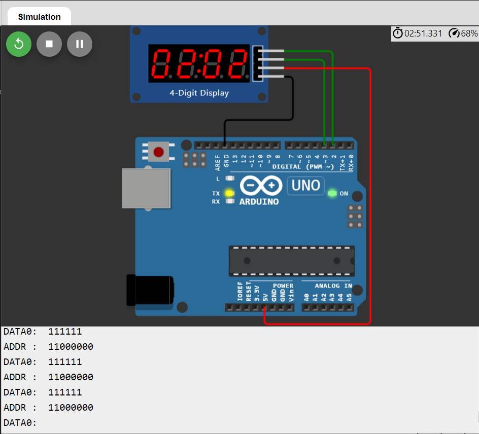

# ¿Qué es el Seven Segment Display TM1637?
Es un driver para display de LED de 7 segmentos y teclado, el cual es sumamente popular debido a su precio económico y muy factible de usar, tanto a nivel electrónico como a nivel de software.
La comunicación con este dispositivo es del tipo serie de dos hilos: una línea para una señal de reloj y otra línea para la información. TM1637 utiliza su propio protocolo TWSI. Al disponer de resistencias pull-up en las líneas de reloj y datos, cuando las comunicaciones se encuentran inactivas el nivel de la señal es alto. Para realizar las pruebas no es crítico pero para el funcionamiento normal sí es relevante considerar que debe establecerse el estado de alta impedancia en los pines de comunicaciones del microcontrolador para enviar un valor 1, y no un nivel alto de salida, ya que serán las resistencias las responsables de subir el nivel en la línea de comunicaciones.

# ¿Cuáles son su Características?
*  Voltaje de alimentación: 3.3 a 5 VDC
*  Consumo de corriente a 5V: 30 mA (nominal) / 80 mA (máxima)
*  Registro de desplazamiento: 74HC595
*  Tamaño del digito: 0.56 inch
*  Color display: Rojo
*  Dimensiones: 42x24x12 mm
*  Temperatura de funcionamiento: -40° C a 80° C

# ¿Cómo funciona?
El módulo funciona por medio de sólo 4 conexiones: dos de energía, una para la señal de reloj y una para datos. Esto reduce considerablemente las conexiones que usualmente tendríamos que hacer para usar cuatro displays de 7 segmentos como estos. Los datos se ingresan al módulo por medio de comunicación serial, de ahí que sólo un pin es necesario para datos, mientras tanto el pin de reloj define el tiempo en que se envían tales datos.
A continuación se describen las conexiones del módulo:
*  VCC = Referencia positiva de 3.3 V a 5V
*  GND = Referencia negativa
*  DIO = Entrada serial de datos
*  CLK = Entrada de  señal de reloj

El envío de los datos al módulo es más bien simple, el fabricante del chip da un instructivo para esto en el data sheet con el fin de que podamos programarlo en un microcontrolador. Para Arduino, el fabricante provee ya una librería con el fin de que podamos mandar datos a nuestro display de la forma más sencilla posible, la librería tiene el nombre de "TM1637.h".

# Ejemplo de Seven Segment Display TM1637 en Wokwi (Simulación).

A continuación se muestra un ejemplo utilizando el driver Seven Segment Display TM1637 para simular un reloj de 24 horas, tanto lo que es la codificación como su resultado; además se muestra el código documentado para analizar el funcionamiento de cada método e instrucciones:

************************************************************ Código ************************************************************

// include the SevenSegmentTM1637 library.

#include "SevenSegmentTM1637.h"

#include "SevenSegmentExtended.h"

/* initialize global TM1637 Display object
   The constructor takes two arguments, the number of the clock pin and the digital output pin:
  SevenSegmentTM1637(byte pinCLK, byte pinDIO);
*/

const byte PIN_CLK = 2;   // define CLK pin (any digital pin)

const byte PIN_DIO = 3;   // define DIO pin (any digital pin)

SevenSegmentExtended      display(PIN_CLK, PIN_DIO);

const unsigned int clockSpeed = 10000;    // speed up clock for demo

// run setup code

void setup() {

  Serial.begin(9600);         // initializes the Serial connection @ 9600 baud
  
  display.begin();            // initializes the display
  
  display.setBacklight(100);  // set the brightness to 100 %
  
  delay(1000);                // wait 1000 ms
  
};

// run loop (forever)

void loop() {

  byte hours    = 00;                           // initialize hours
  
  byte minutes  = 00;                           // initialize minutes
  

  for ( ; hours < 24; hours++) {                // count hours   up to 24
    
  for ( ; minutes < 60; minutes++) {          // count minutes up to 59
    
  display.printTime(hours, minutes, true);  // display time
      
  delay(60000 / clockSpeed);                // clock delay ms
      
  };
    
  minutes = 0;                                // reset minutes
    
  };
  
};

************************************************************ Pantallas de Resultados ************************************************************

 

# Referencias Consultadas.
*  https://www.makerelectronico.com/display-tm1637-4-digitos-7-segmentos/#:~:text=El%20TM1637%20es%20un%20driver,como%20a%20nivel%20de%20software.
*  https://www.arcaelectronica.com/blogs/tutoriales/display-de-7-segmentos-tm1637-con-arduino
*  https://www.vistronica.com/display/modulo-tm1637-con-display-4-digitos-7-segmentos-detail.html
*  https://wokwi.com/projects/339227567530705492
